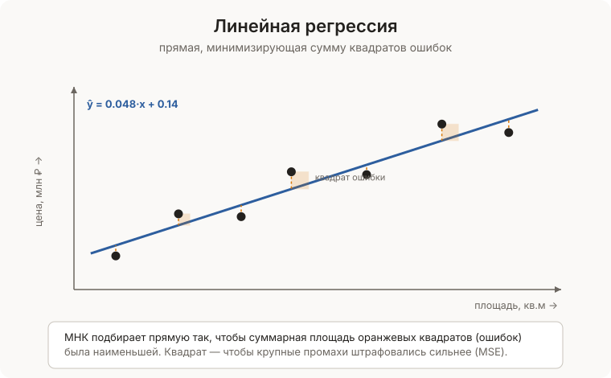

[← Оглавление](../../README.md)

# Линейная регрессия

**Линейная регрессия** — алгоритм, который проводит прямую линию через облако точек данных и использует её для **предсказания числовых значений**.

> **Аналогия:** чем больше площадь квартиры — тем выше цена. Линейная регрессия находит прямую, которая лучше всего описывает эту зависимость. Потом по ней предсказывает цену для новой квартиры.

Это базовый алгоритм машинного обучения для задач **регрессии** — когда нужно предсказать число, а не категорию.

---

### Математическая основа

**Простая линейная регрессия** (один признак):

$$y = w \cdot x + b$$

- $x$ — входной признак (площадь)
- $y$ — предсказание (цена)
- $w$ — наклон прямой (вес/коэффициент)
- $b$ — смещение (intercept, bias)

**Множественная линейная регрессия** (несколько признаков):

$$y = w_1 x_1 + w_2 x_2 + \ldots + w_n x_n + b$$

```
данные:             прямая:
площадь → цена      y = 50 000 * x + 10 000
  50 кв.м → 2.6M    предсказание: 50*50000+10000 = 2.51M
  80 кв.м → 4.1M    предсказание: 80*50000+10000 = 4.01M
 120 кв.м → 6.0M    предсказание: 120*50000+10000 = 6.01M
```

---

### Функция потерь — что минимизируем

**MSE** (Mean Squared Error) — средняя квадратичная ошибка. Сумма квадратов расстояний от точек до прямой.

$$MSE = \frac{1}{n} \sum_{i=1}^{n} (y_i - \hat{y}_i)^2$$

Квадраты нужны чтобы: штрафовать большие ошибки сильнее и убрать знак (ошибки не компенсировали друг друга).

```
точка: реальная цена 4M, предсказание 3.5M → ошибка 0.5M → (0.5)² = 0.25
минимизируем сумму таких квадратов по всем точкам
```



---

### Реализации

#### Аналитическое решение (формула нормальных уравнений)

Для простой линейной регрессии есть точная формула — вычисляется за один проход.

```python
def линейная_регрессия_аналитически(X, y):
    """
    X — список значений признака
    y — список целевых значений
    """
    n = len(X)
    mean_x = sum(X) / n
    mean_y = sum(y) / n

    # числитель и знаменатель формулы наклона
    числитель = sum((X[i] - mean_x) * (y[i] - mean_y) for i in range(n))
    знаменатель = sum((X[i] - mean_x) ** 2 for i in range(n))

    w = числитель / знаменатель
    b = mean_y - w * mean_x

    return w, b


def предсказать(X, w, b):
    return [w * x + b for x in X]


def mse(y_реал, y_пред):
    return sum((a - b) ** 2 for a, b in zip(y_реал, y_пред)) / len(y_реал)


# пример: площадь → цена (млн руб)
X = [30, 50, 70, 80, 100, 120]
y = [1.5, 2.5, 3.5, 4.0, 5.0, 6.0]

w, b = линейная_регрессия_аналитически(X, y)
print(f"y = {w:.4f} * x + {b:.4f}")    # → y = 0.0492 * x + 0.01

предсказания = предсказать(X, w, b)
print(f"MSE: {mse(y, предсказания):.6f}")

# предсказать для новой квартиры:
новая_площадь = 90
print(f"90 кв.м → {w * новая_площадь + b:.2f} млн")
```

#### Градиентный спуск — универсальный метод обучения

Итеративно обновляем веса в направлении уменьшения ошибки. Работает и для множественной регрессии.

```python
def градиентный_спуск(X, y, скорость_обучения=0.0001, эпох=1000):
    """
    X — список признаков (один признак)
    y — список целевых значений
    """
    w, b = 0.0, 0.0
    n = len(X)

    for эпоха in range(эпох):
        # предсказания
        y_пред = [w * x + b for x in X]

        # градиенты (частные производные MSE)
        grad_w = -2/n * sum((y[i] - y_пред[i]) * X[i] for i in range(n))
        grad_b = -2/n * sum(y[i] - y_пред[i] for i in range(n))

        # обновить веса
        w -= скорость_обучения * grad_w
        b -= скорость_обучения * grad_b

        if эпоха % 100 == 0:
            ошибка = sum((y[i] - y_пред[i])**2 for i in range(n)) / n
            print(f"эпоха {эпоха}: MSE={ошибка:.4f}")

    return w, b


X = [30, 50, 70, 80, 100, 120]
y = [1.5, 2.5, 3.5, 4.0, 5.0, 6.0]
w, b = градиентный_спуск(X, y, скорость_обучения=0.0001, эпох=1000)
print(f"y = {w:.4f}x + {b:.4f}")
```

#### Множественная линейная регрессия

```python
def множественная_регрессия(X, y, скорость=0.0001, эпох=1000):
    """
    X — матрица признаков: [[x1_1, x2_1], [x1_2, x2_2], ...]
    y — целевые значения
    """
    n = len(X)
    m = len(X[0])      # количество признаков
    w = [0.0] * m
    b = 0.0

    for _ in range(эпох):
        # предсказания
        y_пред = [sum(w[j] * X[i][j] for j in range(m)) + b for i in range(n)]

        # ошибки
        ошибки = [y[i] - y_пред[i] for i in range(n)]

        # обновить каждый вес
        for j in range(m):
            grad = -2/n * sum(ошибки[i] * X[i][j] for i in range(n))
            w[j] -= скорость * grad
        b -= скорость * (-2/n * sum(ошибки))

    return w, b


# дома: [площадь, комнаты] → цена
X = [[50, 2], [80, 3], [100, 3], [120, 4], [150, 5]]
y = [2.5, 4.0, 5.0, 6.0, 7.5]

w, b = множественная_регрессия(X, y, скорость=0.00001, эпох=5000)
print(f"веса: {[round(v,4) for v in w]}, b={b:.4f}")

# предсказать для нового дома: 90 кв.м, 3 комнаты
x_new = [90, 3]
pred = sum(w[j] * x_new[j] for j in range(len(w))) + b
print(f"90 кв.м, 3 комн → {pred:.2f} млн")
```

#### Полный класс с метриками

```python
class ЛинейнаяРегрессия:
    def __init__(self, скорость=0.0001, эпох=1000):
        self.скорость = скорость
        self.эпох = эпох
        self.w = None
        self.b = 0.0
        self.история_потерь = []

    def fit(self, X, y):
        n = len(X)
        # нормализация признаков
        self._mean = [sum(X[i][j] for i in range(n)) / n for j in range(len(X[0]))]
        self._std  = [
            (sum((X[i][j] - self._mean[j])**2 for i in range(n)) / n) ** 0.5 or 1
            for j in range(len(X[0]))
        ]
        X_норм = self._нормализовать(X)

        m = len(X[0])
        self.w = [0.0] * m
        self.b = 0.0

        for _ in range(self.эпох):
            y_пред = self._предсказать_норм(X_норм)
            ошибки = [y[i] - y_пред[i] for i in range(n)]

            for j in range(m):
                grad = -2/n * sum(ошибки[i] * X_норм[i][j] for i in range(n))
                self.w[j] -= self.скорость * grad
            self.b -= self.скорость * (-2/n * sum(ошибки))

            mse = sum(e**2 for e in ошибки) / n
            self.история_потерь.append(mse)

        return self

    def _нормализовать(self, X):
        return [[(X[i][j] - self._mean[j]) / self._std[j]
                 for j in range(len(X[0]))] for i in range(len(X))]

    def _предсказать_норм(self, X_норм):
        return [sum(self.w[j] * X_норм[i][j] for j in range(len(self.w))) + self.b
                for i in range(len(X_норм))]

    def predict(self, X):
        X_норм = self._нормализовать(X)
        return self._предсказать_норм(X_норм)

    def mse(self, X, y):
        y_пред = self.predict(X)
        return sum((a - b)**2 for a, b in zip(y, y_пред)) / len(y)

    def r2(self, X, y):
        """R² — доля объяснённой дисперсии. 1.0 = идеально."""
        y_пред = self.predict(X)
        mean_y = sum(y) / len(y)
        ss_res = sum((a - b)**2 for a, b in zip(y, y_пред))
        ss_tot = sum((a - mean_y)**2 for a in y)
        return 1 - ss_res / ss_tot if ss_tot else 0


модель = ЛинейнаяРегрессия(скорость=0.01, эпох=2000)
X = [[50, 2], [80, 3], [100, 3], [120, 4], [150, 5]]
y = [2.5, 4.0, 5.0, 6.0, 7.5]
модель.fit(X, y)
print(f"MSE: {модель.mse(X, y):.4f}")
print(f"R²:  {модель.r2(X, y):.4f}")
print(f"предсказание [90, 3]: {модель.predict([[90, 3]])[0]:.2f}")
```

---

### Big O

|Операция|Аналитически|Градиентный спуск|
|---|---|---|
|Обучение|$O(n)$|$O(n \cdot m \cdot E)$|
|Предсказание|$O(m)$|$O(m)$|
|Память|$O(m)$|$O(n \cdot m)$|

$n$ — число объектов, $m$ — число признаков, $E$ — число эпох. Аналитическое решение точнее и быстрее для небольших $m$. Градиентный спуск нужен когда признаков миллионы.

---

### Когда линейная регрессия не работает

```
зависимость нелинейная:      выбросы искажают прямую:
y                             y
|    /                        |    *
|   /                         |  *
|  /   ← прямая               | * *  *   ← выброс
| /                           |*        *
+--------x                    +--------x
```

- **Нелинейные зависимости** → полиномиальная регрессия или нейронные сети
- **Выбросы** → использовать MAE вместо MSE или удалять выбросы
- **Нет линейной зависимости** → другие алгоритмы (деревья решений, [KNN](../../Алгоритмы/Поиск/KNN.md))

---

### Плюсы и минусы

**Плюсы:**

- Простая интерпретация — коэффициенты показывают влияние каждого признака
- Быстрое обучение и предсказание
- Хорошо работает когда зависимость действительно линейная
- Основа для более сложных моделей

**Минусы:**

- Предполагает линейную зависимость — часто не выполняется
- Чувствительна к выбросам (квадратичная ошибка усиливает их вклад)
- Нужна нормализация признаков для градиентного спуска
- Не работает для классификации

---

### Применение

- Прогноз цен — недвижимость, акции, товары
- Прогноз продаж — на основе рекламного бюджета, сезона
- Медицина — зависимость давления от возраста, дозы лекарства
- Экономика — ВВП, инфляция, безработица
- Baseline модель — всегда сравнивать сложные модели с линейной регрессией

```python
# sklearn — промышленная реализация:
from sklearn.linear_model import LinearRegression
from sklearn.preprocessing import StandardScaler

scaler = StandardScaler()
X_scaled = scaler.fit_transform(X)

модель = LinearRegression()
модель.fit(X_scaled, y)
print(f"R²: {модель.score(X_scaled, y):.4f}")
print(f"коэффициенты: {модель.coef_}")
```

> Алгоритм для классификации — [KNN — k ближайших соседей](../../Алгоритмы/Поиск/KNN.md). Нотация — Вычислительная сложность.
