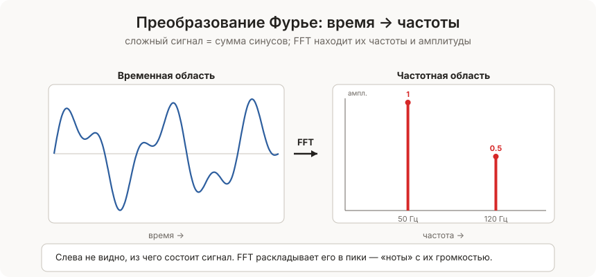

[← Оглавление](../../README.md)

# Преобразование Фурье

**Преобразование Фурье** — математический инструмент, который разбивает сложный сигнал на составляющие **частоты**. Показывает «из каких нот состоит мелодия».

> **Аналогия:** коктейль. Дан напиток — Фурье выясняет из каких ингредиентов и в какой пропорции он состоит. Музыкальный трек — Фурье выясняет какие частоты (ноты) в него входят и насколько громко.

---

### Что такое частотный анализ

Любой периодический сигнал можно представить как сумму синусоид разных частот и амплитуд:

```
сложный сигнал = sin(440Hz) + 0.5·sin(880Hz) + 0.3·sin(1320Hz)
                 нота Ля      октава выше      квинта

Фурье «видит» три пика: на 440, 880 и 1320 Гц
```

**Временная область** — сигнал как функция времени (как на осциллографе). **Частотная область** — тот же сигнал как набор частот (как на эквалайзере).

Фурье переводит между ними в обе стороны.

---



### Виды преобразований

|Вид|Когда|Сложность|
|---|---|---|
|DFT (дискретное)|Конечный набор отсчётов|$O(n^2)$|
|FFT (быстрое)|То же, но эффективно|$O(n \log n)$|
|STFT (краткосрочное)|Сигнал меняется со временем|$O(n \log n)$ по окнам|
|Обратное (IFFT)|Из частот обратно в сигнал|$O(n \log n)$|

FFT — это не другое математическое преобразование, а **быстрый алгоритм** вычисления DFT через стратегию «разделяй и властвуй».

---

### Реализации

#### DFT — наивная реализация $O(n^2)$

```python
import cmath
import math

def dft(x):
    """
    x — список отсчётов сигнала
    возвращает список комплексных амплитуд частот
    """
    N = len(x)
    X = []
    for k in range(N):
        сумма = sum(
            x[n] * cmath.exp(-2j * math.pi * k * n / N)
            for n in range(N)
        )
        X.append(сумма)
    return X

def обратный_dft(X):
    """Из частот обратно в сигнал."""
    N = len(X)
    x = []
    for n in range(N):
        сумма = sum(
            X[k] * cmath.exp(2j * math.pi * k * n / N)
            for k in range(N)
        )
        x.append(сумма.real / N)
    return x


# пример: синус 1 Гц, дискретизация 8 точек
import math
сигнал = [math.sin(2 * math.pi * i / 8) for i in range(8)]
спектр = dft(сигнал)

# амплитуды каждой частоты:
for k, ампл in enumerate(спектр):
    модуль = abs(ампл)
    if модуль > 0.001:
        print(f"частота {k}: амплитуда {модуль:.2f}")
# → частота 1: 4.00 (только первая гармоника — идеальный синус)
```

#### FFT — быстрый алгоритм Кули — Тьюки $O(n \log n)$

Разбивает DFT на чётные и нечётные индексы рекурсивно. Требует $n = 2^k$.

```python
import cmath
import math

def fft(x):
    """
    Рекурсивный FFT (алгоритм Кули-Тьюки).
    len(x) должно быть степенью двойки.
    """
    N = len(x)
    if N <= 1:
        return x

    # разделить на чётные и нечётные
    чётные = fft(x[::2])
    нечётные = fft(x[1::2])

    # объединить
    T = [cmath.exp(-2j * math.pi * k / N) * нечётные[k]
         for k in range(N // 2)]

    return ([чётные[k] + T[k] for k in range(N // 2)] +
            [чётные[k] - T[k] for k in range(N // 2)])


def ifft(X):
    """Обратное FFT."""
    N = len(X)
    # сопряжённые → fft → сопряжённые → делим на N
    сопр = [x.conjugate() for x in X]
    результат = fft(сопр)
    return [x.conjugate().real / N for x in результат]


# пример:
import math
N = 8
сигнал = [math.sin(2 * math.pi * i / N) + 0.5 * math.sin(2 * math.pi * 2 * i / N)
          for i in range(N)]

спектр = fft(сигнал)
for k, X_k in enumerate(спектр):
    if abs(X_k) > 0.01:
        print(f"частота {k}: амплитуда {abs(X_k):.2f}")
# → частота 1: 4.00  (первая гармоника)
# → частота 2: 2.00  (вторая гармоника, амплитуда 0.5)

# восстановить сигнал:
восстановленный = ifft(спектр)
print([round(x, 6) for x in восстановленный])
# → совпадает с исходным сигналом
```

#### Использование numpy.fft — промышленный стандарт

```python
import numpy as np

# создать сигнал: сумма двух синусоид
частота_дискр = 1000   # Гц (точек в секунду)
длительность  = 1.0    # секунды
t = np.linspace(0, длительность, int(частота_дискр * длительность))

# сигнал = 50 Гц + 120 Гц
сигнал = np.sin(2 * np.pi * 50 * t) + 0.5 * np.sin(2 * np.pi * 120 * t)

# FFT:
спектр = np.fft.fft(сигнал)
частоты = np.fft.fftfreq(len(t), d=1/частота_дискр)

# амплитудный спектр (только положительные частоты):
N = len(t)
амплитуды = np.abs(спектр[:N//2]) * 2 / N

# найти пики:
пики_idx = np.where(амплитуды > 0.1)[0]
for idx in пики_idx:
    print(f"{частоты[idx]:.0f} Гц: амплитуда {амплитуды[idx]:.2f}")
# → 50 Гц: амплитуда 1.00
# → 120 Гц: амплитуда 0.50

# обратное FFT:
сигнал_восст = np.fft.ifft(спектр).real
print(np.allclose(сигнал, сигнал_восст))   # → True
```

#### Фильтрация в частотной области

Проще обнулить нежелательные частоты, чем фильтровать во временной области.

```python
import numpy as np

def фильтр_нижних_частот(сигнал, порог_частота, частота_дискр):
    """Убрать все частоты выше порогового значения (шум)."""
    N = len(сигнал)
    спектр = np.fft.fft(сигнал)
    частоты = np.fft.fftfreq(N, d=1/частота_дискр)

    # обнулить частоты выше порога
    спектр[np.abs(частоты) > порог_частота] = 0

    return np.fft.ifft(спектр).real


def фильтр_высоких_частот(сигнал, порог_частота, частота_дискр):
    N = len(сигнал)
    спектр = np.fft.fft(сигнал)
    частоты = np.fft.fftfreq(N, d=1/частота_дискр)
    спектр[np.abs(частоты) < порог_частота] = 0
    return np.fft.ifft(спектр).real


# пример: шумный сигнал → очистить
частота_дискр = 1000
t = np.linspace(0, 1, частота_дискр)
чистый     = np.sin(2 * np.pi * 10 * t)         # 10 Гц сигнал
шум        = np.random.normal(0, 0.5, len(t))    # случайный шум
зашумлённый = чистый + шум

очищенный = фильтр_нижних_частот(зашумлённый, порог_частота=50, частота_дискр=частота_дискр)
# очищенный ≈ чистый
```

#### Свёртка через FFT

Свёртка во временной области — $O(n \cdot m)$. Через FFT — $O(n \log n)$.

```python
import numpy as np

def свёртка_fft(сигнал, ядро):
    """Свёртка через FFT — быстрее чем прямая."""
    N = len(сигнал) + len(ядро) - 1
    # дополнить до степени двойки для эффективности
    N_fft = 1
    while N_fft < N:
        N_fft *= 2

    F_сигнал = np.fft.fft(сигнал, N_fft)
    F_ядро   = np.fft.fft(ядро, N_fft)
    результат = np.fft.ifft(F_сигнал * F_ядро).real
    return результат[:N]


сигнал = [1, 2, 3, 4, 5]
ядро   = [0.2, 0.6, 0.2]   # сглаживающий фильтр
свёрнутый = свёртка_fft(сигнал, ядро)
print([round(x, 2) for x in свёрнутый])
# → [0.2, 1.0, 2.0, 3.0, 4.0, 3.8, 1.0]
```

---

### Big O

|Алгоритм|Сложность|Память|
|---|---|---|
|DFT наивный|$O(n^2)$|$O(n)$|
|FFT (Кули-Тьюки)|$O(n \log n)$|$O(n \log n)$ рекурсия|
|FFT итеративный|$O(n \log n)$|$O(n)$|
|IFFT|$O(n \log n)$|$O(n)$|

Для $n = 1\ 000\ 000$: DFT = $10^{12}$ операций, FFT = $2 \times 10^7$ — в **50 000 раз быстрее**.

---

### Плюсы и минусы

**Плюсы:**

- Превращает $O(n^2)$ свёртку в $O(n \log n)$
- Позволяет эффективно фильтровать сигналы
- Основа сжатия JPEG, MP3 (через родственный DCT)
- Применяется к любым периодическим данным

**Минусы:**

- FFT требует $n = 2^k$ (или сложнее для произвольных $n$)
- Результат — комплексные числа, нужна интерпретация
- Предполагает периодичность — на краях могут быть артефакты

---

### Применение

- **Сжатие MP3** — удалить неслышимые человеку частоты
- **Сжатие JPEG** — DCT (косинусное преобразование, родственник FFT) сжимает блоки 8×8
- **Shazam** — снятие «отпечатка» песни по спектральным пикам
- **Фильтрация шума** — убрать фоновый гул в аудио
- **Обработка изображений** — размытие, резкость через свёртку в FFT
- **Радар и телекоммуникации** — анализ радиосигналов
- **Решение дифференциальных уравнений** — Фурье упрощает ДУ в частных производных

> Нотация — Вычислительная сложность. Применяется в сжатии данных совместно с [Код Хаффмана](../../Алгоритмы/Поиск/Код%20Хаффмана.md).
