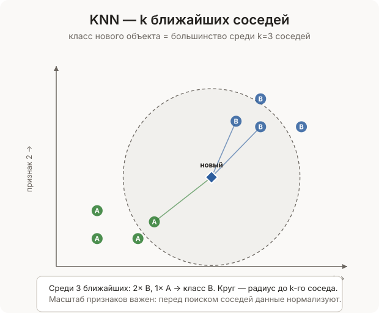

[← Оглавление](../../README.md)

# KNN — k ближайших соседей

**KNN** (K-Nearest Neighbors) — классифицировать или предсказать значение для нового объекта, найдя $k$ наиболее похожих известных объектов и взяв у них ответ.

> **Аналогия:** хочешь узнать, понравится ли тебе ресторан. Спрашиваешь пятерых знакомых с похожими вкусами — если четверо говорят «да», скорее всего тебе тоже понравится.

KNN — алгоритм **машинного обучения** без модели: никакой предварительной тренировки, просто ищем похожие примеры в данных каждый раз заново.

---

### Два режима

**Классификация** — к какой категории относится объект. Берём класс большинства среди $k$ соседей.

```
новый фрукт: размер=7, краснота=8
3 ближайших соседа: яблоко, яблоко, апельсин
→ класс: яблоко (2 из 3)
```

**Регрессия** — предсказать числовое значение. Берём среднее (или взвешенное среднее) у $k$ соседей.

```
новый дом: площадь=120 кв.м, 3 комнаты
3 ближайших соседа: стоят 5М, 5.5М, 6М руб.
→ предсказание: (5 + 5.5 + 6) / 3 = 5.5М
```

---



### Как измерить расстояние

Каждый объект — вектор признаков. Расстояние между объектами = насколько они похожи.

#### Евклидово расстояние — стандартное

«Прямое» расстояние как по линейке. Работает для числовых признаков в одном масштабе.

```python
import math

def евклидово(a, b):
    return math.sqrt(sum((x - y) ** 2 for x, y in zip(a, b)))

евклидово([1, 2, 3], [4, 6, 3])   # → 5.0
```

#### Манхэттенское расстояние

Сумма абсолютных разностей. Работает лучше евклидова в пространствах с большим числом измерений.

```python
def манхэттенское(a, b):
    return sum(abs(x - y) for x, y in zip(a, b))

манхэттенское([1, 2], [4, 6])   # → 7
```

#### Косинусное расстояние

Измеряет угол между векторами, не длину. Стандарт для текстов — длина документа не важна, важно направление.

```python
def косинусное(a, b):
    dot = sum(x * y for x, y in zip(a, b))
    норма_a = math.sqrt(sum(x**2 for x in a))
    норма_b = math.sqrt(sum(x**2 for x in b))
    if норма_a == 0 or норма_b == 0:
        return 1.0
    return 1 - dot / (норма_a * норма_b)   # 0 = одинаковые, 1 = перпендикулярные
```

---

### Реализации

#### Базовая KNN-классификация

```python
import math
from collections import Counter

def knn_classify(обучающие, метки, новый, k=3):
    """
    обучающие — список векторов признаков
    метки     — список классов для каждого вектора
    новый     — вектор признаков нового объекта
    """
    расстояния = []
    for i, точка in enumerate(обучающие):
        d = math.sqrt(sum((a - b) ** 2 for a, b in zip(точка, новый)))
        расстояния.append((d, метки[i]))

    расстояния.sort(key=lambda x: x[0])
    k_ближайших = [метка for _, метка in расстояния[:k]]

    return Counter(k_ближайших).most_common(1)[0][0]


X = [[1, 1], [2, 1], [1, 2],   # класс A
     [5, 5], [6, 5], [5, 6]]   # класс B
y = ["A", "A", "A", "B", "B", "B"]

knn_classify(X, y, [1.5, 1.5], k=3)   # → "A"
knn_classify(X, y, [5.5, 5.5], k=3)   # → "B"
knn_classify(X, y, [3.5, 3.5], k=3)   # → зависит от распределения
```

#### KNN-регрессия

```python
def knn_regress(обучающие, значения, новый, k=3):
    расстояния = []
    for i, точка in enumerate(обучающие):
        d = math.sqrt(sum((a - b) ** 2 for a, b in zip(точка, новый)))
        расстояния.append((d, значения[i]))

    расстояния.sort(key=lambda x: x[0])
    k_ближайших = [v for _, v in расстояния[:k]]
    return sum(k_ближайших) / len(k_ближайших)


дома = [[50, 1], [80, 2], [100, 3], [150, 4]]  # [площадь, комнаты]
цены = [3_000_000, 4_500_000, 6_000_000, 9_000_000]

knn_regress(дома, цены, [90, 2], k=2)   # → 5_250_000
```

#### Взвешенный KNN — ближние соседи важнее

Вес каждого соседа обратно пропорционален расстоянию: ближе = влиятельнее.

```python
def knn_weighted(обучающие, метки, новый, k=3):
    расстояния = []
    for i, точка in enumerate(обучающие):
        d = math.sqrt(sum((a - b) ** 2 for a, b in zip(точка, новый)))
        расстояния.append((d, метки[i]))

    расстояния.sort(key=lambda x: x[0])
    k_ближайших = расстояния[:k]

    веса = {}
    for d, метка in k_ближайших:
        вес = 1 / (d + 1e-10)   # +epsilon чтобы не делить на ноль
        веса[метка] = веса.get(метка, 0) + вес

    return max(веса, key=веса.get)
```

#### Нормализация признаков (важно!)

Признаки в разных масштабах искажают расстояния. Площадь 0–200 и цена 0–10 млн — цена будет доминировать без нормализации.

```python
def нормализовать(X):
    """Min-max нормализация: каждый признак в диапазон [0, 1]"""
    if not X:
        return X
    n_признаков = len(X[0])
    минимумы = [min(точка[i] for точка in X) for i in range(n_признаков)]
    максимумы = [max(точка[i] для точка in X) for i in range(n_признаков)]
    результат = []
    for точка in X:
        норм = []
        for i in range(n_признаков):
            диапазон = максимумы[i] - минимумы[i]
            если_нулевой = 0 if диапазон == 0 else (точка[i] - минимумы[i]) / диапазон
            норм.append(если_нулевой)
        результат.append(норм)
    return результат


X_сырые = [[50, 1_000_000], [80, 2_000_000], [100, 3_000_000]]
X_норм = нормализовать(X_сырые)
# → [[0.0, 0.0], [0.6, 0.5], [1.0, 1.0]]
```

#### Полный класс KNN

```python
import math
from collections import Counter

class KNN:
    def __init__(self, k=3, задача="классификация", метрика="евклид"):
        self.k = k
        self.задача = задача
        self.метрика = метрика
        self.X_train = None
        self.y_train = None

    def fit(self, X, y):
        self.X_train = X
        self.y_train = y

    def _расстояние(self, a, b):
        if self.метрика == "евклид":
            return math.sqrt(sum((x - y) ** 2 for x, y in zip(a, b)))
        elif self.метрика == "манхэттен":
            return sum(abs(x - y) for x, y in zip(a, b))
        raise ValueError(f"неизвестная метрика: {self.метрика}")

    def _предсказать_один(self, x):
        расстояния = sorted(
            ((self._расстояние(x, xi), yi)
             for xi, yi in zip(self.X_train, self.y_train)),
            key=lambda p: p[0]
        )
        k_ближ = [yi for _, yi in расстояния[:self.k]]

        if self.задача == "классификация":
            return Counter(k_ближ).most_common(1)[0][0]
        else:
            return sum(k_ближ) / len(k_ближ)

    def predict(self, X):
        return [self._предсказать_один(x) for x in X]

    def score(self, X, y):
        предсказания = self.predict(X)
        if self.задача == "классификация":
            верные = sum(p == t for p, t in zip(предсказания, y))
            return верные / len(y)
        else:
            mse = sum((p - t) ** 2 for p, t in zip(предсказания, y)) / len(y)
            return mse


# классификация:
модель = KNN(k=3, задача="классификация")
модель.fit([[1,1],[2,1],[5,5],[6,5]], ["A","A","B","B"])
модель.predict([[1.5, 1.5], [5.5, 5.5]])   # → ["A", "B"]
print(модель.score([[1,1],[5,5]], ["A","B"]))  # → 1.0

# регрессия:
модель_рег = KNN(k=2, задача="регрессия")
модель_рег.fit([[1],[2],[3],[4]], [10, 20, 30, 40])
модель_рег.predict([[2.5]])   # → [25.0]
```

---

### Выбор k

|$k$|Эффект|Проблема|
|---|---|---|
|Слишком маленький (k=1)|Чувствителен к каждой точке|Переобучение, шум влияет|
|Оптимальный|Хороший баланс|Подбирается экспериментально|
|Слишком большой|Учитывает много соседей|Переглаживание, теряет детали|

Обычно подбирают $k$ через кросс-валидацию. Часто начинают с $k = \sqrt{n}$, где $n$ — размер обучающей выборки.

```python
# подбор оптимального k:
лучший_k = 1
лучший_счёт = 0
for k in range(1, 20):
    модель = KNN(k=k)
    модель.fit(X_train, y_train)
    счёт = модель.score(X_val, y_val)
    if счёт > лучший_счёт:
        лучший_счёт = счёт
        лучший_k = k
```

---

### Big O

|Операция|Сложность|
|---|---|
|Обучение|$O(1)$ — просто сохраняем данные|
|Предсказание одного объекта|$O(n \cdot d)$ — расстояние до каждой точки|
|Предсказание $m$ объектов|$O(m \cdot n \cdot d)$|
|Память|$O(n \cdot d)$ — хранить все данные|

$n$ — размер обучающей выборки, $d$ — число признаков.

«Обучение» мгновенное, но предсказание медленное — противоположность нейронным сетям.

---

### Плюсы и минусы

**Плюсы:**

- Обучение за $O(1)$ — просто сохранить данные
- Интуитивно понятен
- Работает без предположений о распределении данных
- Легко адаптировать: сменить метрику, изменить $k$
- Хорошо работает на небольших данных с хорошими признаками

**Минусы:**

- Медленное предсказание — $O(n)$ на каждый объект
- Требует хранить все обучающие данные
- Плохо масштабируется на больших данных
- Чувствителен к масштабу признаков — нужна нормализация
- Страдает от «проклятия размерности» — с ростом числа признаков все точки становятся одинаково далёкими
- Не работает с категориальными признаками без преобразования

---

### Применение

- Рекомендательные системы — «пользователи похожие на тебя смотрели X»
- Классификация спама — похоже на известные спам-письма?
- Медицинская диагностика — симптомы похожи на известные случаи
- Распознавание рукописных цифр (MNIST) — похоже на какую цифру?
- Поиск аномалий — объект далёк от всех соседей → аномалия
- Заполнение пропущенных значений — взять среднее у похожих объектов

```python
# sklearn — промышленная реализация:
from sklearn.neighbors import KNeighborsClassifier

модель = KNeighborsClassifier(n_neighbors=3)
модель.fit(X_train, y_train)
модель.predict(X_test)
```

> Другие алгоритмы поиска — [BFS — поиск в ширину](../../Алгоритмы/Поиск/BFS.md), [DFS — поиск в глубину](../../Алгоритмы/Поиск/DFS.md). Нотация — Вычислительная сложность.
